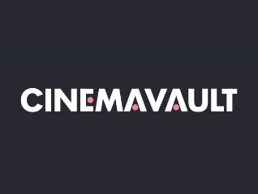
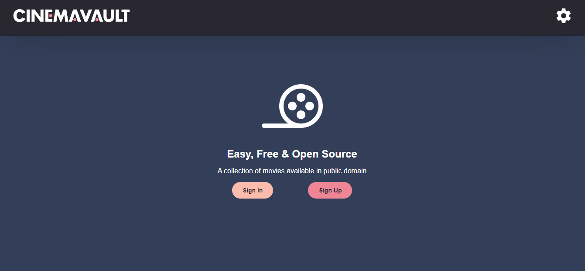
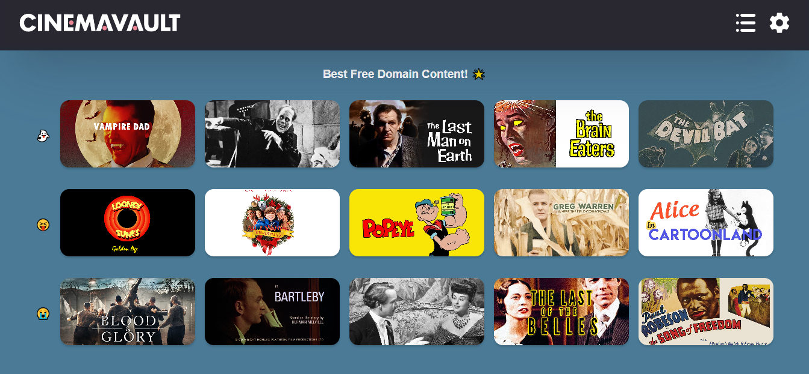
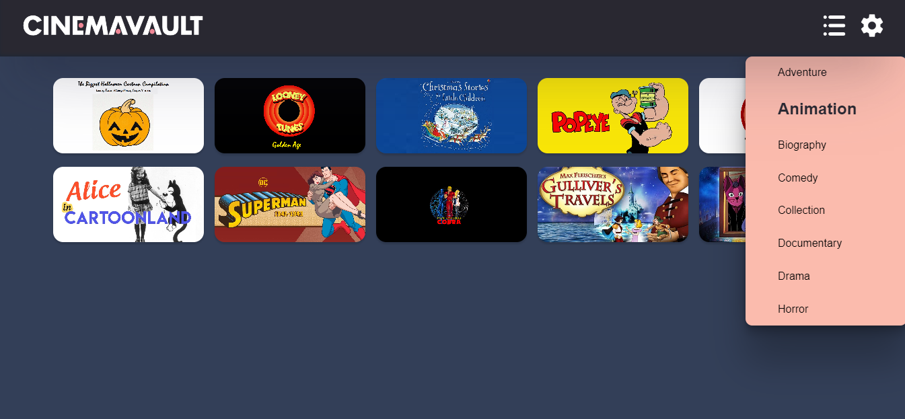
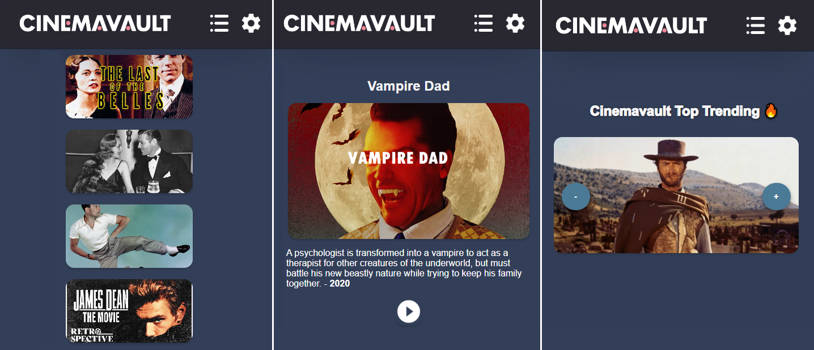

    
    <h1>Cinemavault</h1>
    
A Stream of Public Domain Movies Available on YouTube

## Code
- [__API__](https://github.com/pedrjose/cinemavault-api): Back-end code repository;
- [__SPA__](https://github.com/pedrjose/cinemavault-spa): Front-end code repository.

  
  
  

## Features
- Create account;
- Search content by word;
- List content by genre;
- Access content on YouTube.

## Device Compatibility
- Mobile (max-width:570px);
- iPad (1024x768);
- Laptop (1440x900);
- Desktop (1680x1050);
- Desktop (1920x1080);
- Desktop (min-width:2560px).

  

## Prerequisites
- Network access;
- Installed browser.

## Acknowledgments
- __Free Domain Content Provider__: YouTube Channels that made the content used in the API available [Cult Cinema Classics 
](https://www.youtube.com/@CultCinemaClassics) [FREE MOVIES](https://www.youtube.com/@FREEMOVIESYT/videos) [8thManDVD.com™ Cartoon Channel](https://www.youtube.com/@8thManDVDcom) [PUBLIC DOMAIN](https://www.youtube.com/@publicdomain7466) [Public domain cartoons](https://www.youtube.com/@publicdomain7466) [Public Domain Database](https://www.youtube.com/@publicdomaindatabase8902);
- __Collaborators__: Thanks to my friends [Aryosmar](https://github.com/Aryosmar) and [Fabricio](https://github.com/fabricio54) who helped me register the movies in the API.

## Warning
The project was created for full-stack studies, and the servers used for hosting are free, resulting in slow response times and, consequently, slow navigation on the site.

## Disclaimer
This project and its contents are not affiliated with, funded, authorized, endorsed by, or in any way associated with Free Content Providers or any of their affiliates and subsidiaries.

Any trademarks, service marks, trade names, or other intellectual property rights mentioned or used in this project are the property of their respective owners.
